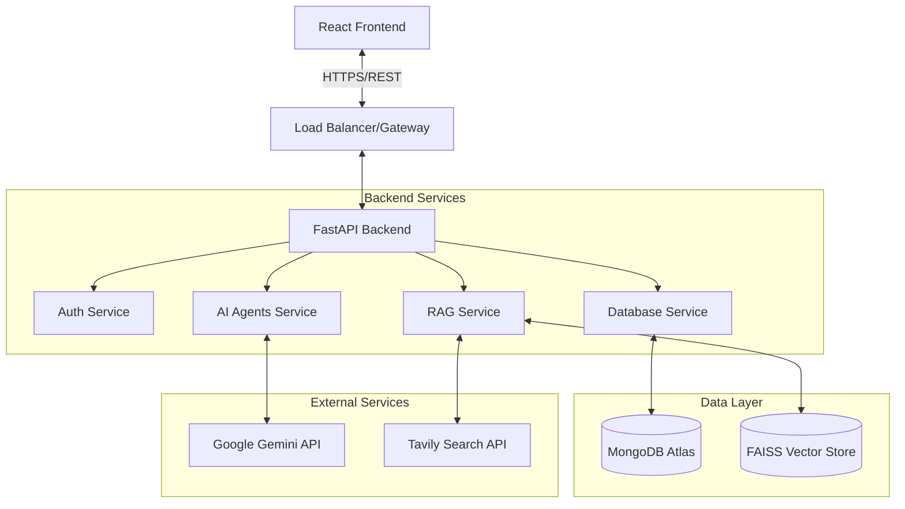

# Lerno AI - System Design Document

## 1. System Architecture

Lerno follows a modern **Client-Server Architecture** featuring a decoupled frontend and backend, communicating via RESTful APIs.

### High-Level Diagram

## 2. Component Design

### 2.1 Frontend (Client)
- **Framework**: React 19 + Vite
- **Styling**: Structured CSS with design tokens for consistent theming (Glassmorphism).
- **State Management**: React Context API for global state (Auth, Theme).
- **Routing**: React Router for SPA navigation.

### 2.2 Backend (Server)
- **Framework**: FastAPI (Python) for high-performance, async API handling.
- **API Structure**:
    - `/auth`: Login, Signup, Token management.
    - `/agents`: Endpoints for Roadmap, Quiz, and general AI interactions.
    - `/rag`: Document upload, processing, and Q&A endpoints.
    - `/users`: Profile and data management.

### 2.3 AI & Data Processing
- **Orchestration**: Custom Agent classes (`QuizAgent`, `RoadmapAgent`) managing conversation flow and state.
- **RAG Engine**:
    - **Ingestion**: `pypdf`, `python-docx`, `python-pptx` for text extraction.
    - **Embedding**: `GoogleGenerativeAIEmbeddings` via LangChain.
    - **Vector Store**: **FAISS** (In-memory/Local) for fast similarity search.
    - **Retrieval**: Semantic search + history-aware query rephrasing.

### 2.4 Database Schema (MongoDB)
- **Users Collection**: Stores user credentials (hashed), profile info.
- **Chats Collection**:
    - `chat_id`: Unique identifier.
    - `user_id`: Owner.
    - `agent_type`: (quiz, roadmap, rag).
    - `history`: List of message objects (role, content, timestamp).
    - `metadata`: Session-specific data (e.g., current quiz score).

## 3. Technology Stack

| Component | Technology | Reasoning |
|-----------|------------|-----------|
| **Backend** | Python, FastAPI | Async support, rich AI/ML ecosystem. |
| **Frontend** | React, Vite | Component-based, fast build times. |
| **Database** | MongoDB | Flexible schema for storing JSON-like chat history. |
| **Vector DB** | FAISS | Lightweight, efficient, easy to deploy (no complex infra). |
| **AI Model** | Gemini 2.5 Flash | High speed, large context window, cost-effective. |
| **Search** | Tavily API | Optimized for LLM RAG context. |

## 4. Security Design
- **Authentication**: Bearer Token (JWT) flow. Tokens expire and must be refreshed.
- **Passwords**: Hashed using **Argon2**, a memory-hard function resistant to GPU cracking.
- **CORS**: Strictly configured to allow only trusted frontend origins.
- **Environment**: Sensitive keys (`GOOGLE_API_KEY`, `MONGO_URI`) stored in `.env` and injected at runtime.
